# Instrukcja administracji serwisu

Dla osoby, która prowadzi serwis szkolenia.iskt.pl na co dzień. **Nie trzeba znać się
na programowaniu** — wszystko, co opisuje ta instrukcja, robi się myszą w panelu.
Nie ma tu ani jednej czynności wymagającej dotykania plików.

Instrukcja jest napisana z klikania, a nie z pamięci: każdy ekran na zrzutach pochodzi
z prawdziwego panelu, a zdania o tym „co się wtedy stanie” zostały sprawdzone przez
wykonanie tej czynności. Spis sprawdzeń jest na końcu, w rozdziale 14.

> Eksportu, importu i przywracania serwisu **ta instrukcja nie opisuje** — to osobny
> dokument przekazania (zadanie 13 planu). Usuwanie treści demonstracyjnych opisuje
> [`DANE-DEMONSTRACYJNE.md`](DANE-DEMONSTRACYJNE.md). Patrz rozdział 12.

---

## Spis treści

1. [Wejście do panelu i mapa menu](#1-wejście-do-panelu-i-mapa-menu)
2. [Szkolenia](#2-szkolenia)
3. [Terminy](#3-terminy)
4. [Trenerzy](#4-trenerzy)
5. [Aktualności](#5-aktualności)
6. [Teksty serwisu — zmiana dowolnego napisu](#6-teksty-serwisu--zmiana-dowolnego-napisu)
7. [Strona główna: sekcje i „Dla Ciebie / Dla firm”](#7-strona-główna-sekcje-i-dla-ciebie--dla-firm)
8. [Kategorie szkoleń i ich symbole](#8-kategorie-szkoleń-i-ich-symbole)
9. [Zdjęcia](#9-zdjęcia)
10. [Kto co może — role](#10-kto-co-może--role)
11. [Czego serwis nie robi](#11-czego-serwis-nie-robi)
12. [Kopia, przeniesienie, dane demonstracyjne](#12-kopia-przeniesienie-dane-demonstracyjne)
13. [Kiedy coś nie wygląda tak, jak powinno](#13-kiedy-coś-nie-wygląda-tak-jak-powinno)
14. [Co zostało sprawdzone przy pisaniu tej instrukcji](#14-co-zostało-sprawdzone-przy-pisaniu-tej-instrukcji)

---

## 1. Wejście do panelu i mapa menu

Panel otwiera się pod adresem serwisu z dopiskiem `/wp-admin` (w środowisku roboczym:
`http://localhost:8888/wp-admin`, login `admin`, hasło `password`).

Po lewej stronie jest menu. Najważniejsze pozycje:

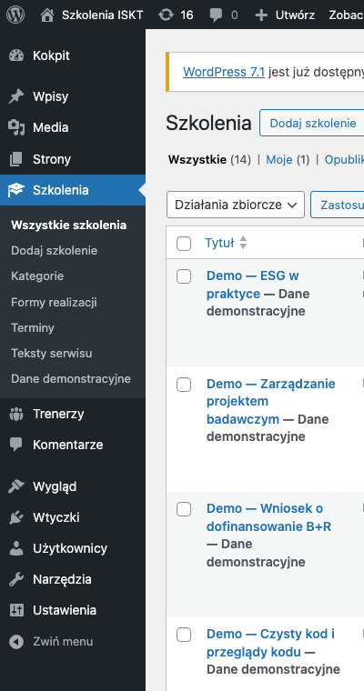

| Pozycja menu | Co się tam robi |
|---|---|
| **Szkolenia** | oferta: opisy szkoleń, ceny, program |
| Szkolenia → **Kategorie** | obszary szkoleń (AI, ESG, …) razem z ich symbolami |
| Szkolenia → **Formy realizacji** | online / stacjonarnie / hybrydowo |
| Szkolenia → **Terminy** | daty realizacji — każdy termin należy do jednego szkolenia |
| Szkolenia → **Teksty serwisu** | wszystkie napisy serwisu spoza treści wpisów |
| Szkolenia → **Dane demonstracyjne** | spis i usunięcie treści założonych na pokaz |
| **Trenerzy** | profile prowadzących |
| **Wpisy** | aktualności (WordPress nazywa je „wpisami”) |
| **Strony** | strona główna, strona zgłoszenia, strony informacyjne |
| **Wygląd → Menu** | odnośniki w nagłówku i stopce |
| **Wygląd → Widżety** | treść stopki |
| **Media** | wszystkie wgrane zdjęcia |

Trzy rzeczy, które warto wiedzieć na starcie:

- **Terminy są osobno od szkoleń.** Jedno szkolenie ma dowolnie wiele terminów i nie
  trzeba dla nich powielać opisu.
- **Powiązanie trener ↔ szkolenie ustawia się w jednym miejscu** — na szkoleniu.
  Profil trenera sam pokazuje, co prowadzi.
- **Każdy napis w serwisie da się zmienić z panelu.** Jeśli czegoś nie ma w treści
  wpisu, jest w „Tekstach serwisu”.

---

## 2. Szkolenia

### 2.1 Dodanie szkolenia

**Szkolenia → Dodaj szkolenie.** Na górze wpisujesz tytuł, pod nim — w zwykłym edytorze —
opis szkolenia. Poniżej edytora jest skrzynka **„Dane szkolenia”**:

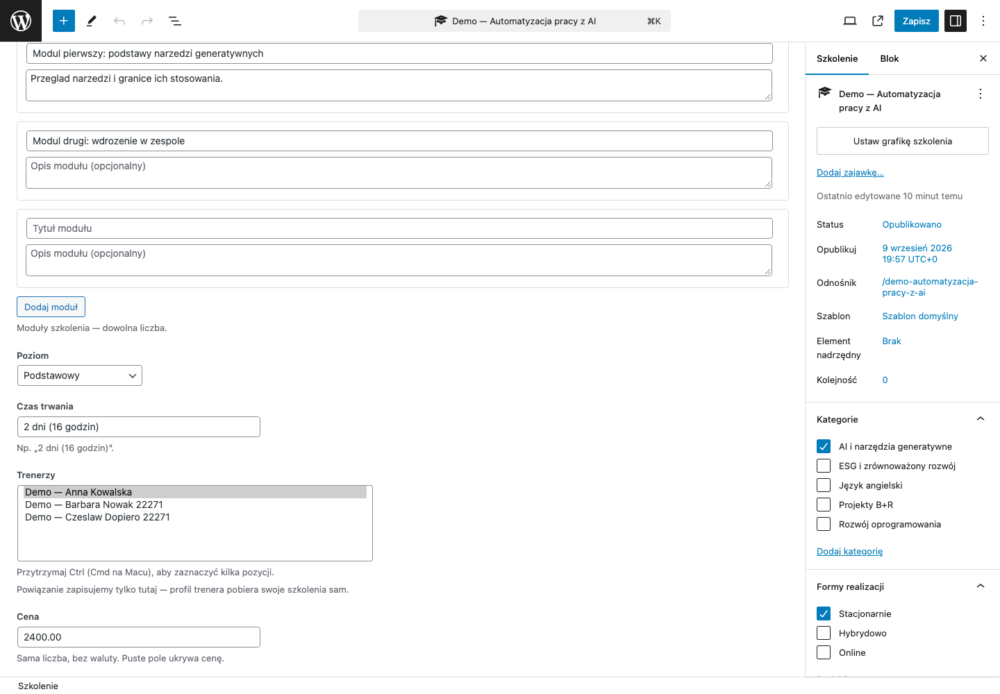

| Pole | Do czego służy |
|---|---|
| **Grupa docelowa** | dla kogo jest szkolenie — osobna sekcja na stronie |
| **Korzyści i efekty uczenia** | jedna korzyść w wierszu; z tego powstaje lista wypunktowana |
| **Program** | moduły szkolenia; „Dodaj moduł” dokłada kolejny wiersz. Moduł bez tytułu nie zapisuje się |
| **Poziom** | podstawowy / średniozaawansowany / zaawansowany / wszystkie poziomy |
| **Czas trwania** | wpisujesz własnymi słowami, np. „2 dni (16 godzin)” |
| **Trenerzy** | kto prowadzi — kilku zaznaczysz z klawiszem Ctrl (Cmd na Macu). Na stronie szkolenia pokażą się w takiej kolejności, w jakiej stoją na tej liście (alfabetycznie), niezależnie od kolejności klikania |
| **Cena** | **sama liczba, bez „zł”**. Puste pole ukrywa cenę na stronie |
| **Jednostka ceny** | za osobę / za grupę / za osobodzień / do ustalenia indywidualnie |
| **Prezentacja podatku** | netto (+ VAT) / brutto (z VAT) / zwolnione z VAT |
| **Szkolenie objęte dofinansowaniem** | zaznaczenie pokazuje odznakę i sekcję o dofinansowaniu |
| **Warunki dofinansowania** | opis warunków przy tym konkretnym szkoleniu |
| **Wyróżnij szkolenie** | wyróżnione szkolenia trafiają na stronę główną i pod artykuły aktualności |

W kolumnie po prawej ustawiasz **Kategorie** (obszar) i **Formy realizacji**, a przyciskiem
**„Ustaw grafikę szkolenia”** — zdjęcie. Wszystkie te pola są opcjonalne: puste pole po prostu
nie pokazuje swojej sekcji, zamiast zostawiać na stronie pusty nagłówek.

### 2.2 Publikacja, wycofanie, kosz

Przycisk **„Opublikuj”** udostępnia szkolenie odwiedzającym. Później ten sam róg ekranu
pozwala zmienić **Status** na „Szkic” — to właśnie **wycofanie z publikacji**.

Co dzieje się z czym (sprawdzone przez wykonanie każdej z tych czynności):

| Co robisz | Strona szkolenia | Katalog `/szkolenia/` | Terminy szkolenia |
|---|---|---|---|
| Publikujesz | działa pod `/szkolenia/tytuł-szkolenia/` | widoczne | pokazują się na stronie szkolenia |
| Zmieniasz status na **Szkic** | „nie znaleziono” | znika | **zostają nietknięte** w panelu |
| Publikujesz ponownie | **ten sam adres** co wcześniej | wraca | wracają |
| Przenosisz **do kosza** | „nie znaleziono” | znika | **zostają nietknięte** |
| Przywracasz z kosza | wraca, ale **jako szkic** — trzeba kliknąć „Opublikuj” | po publikacji | zostają |
| **Usuwasz trwale** | adres przestaje istnieć | znika | **terminy tego szkolenia też znikają, bezpowrotnie** |

Wniosek praktyczny: **do archiwizacji używaj szkicu albo kosza, nie trwałego usuwania.**
Szkic i kosz są odwracalne i nie ruszają terminów. Trwałe usunięcie kasuje razem ze
szkoleniem jego terminy — i tego nie da się cofnąć z panelu.

### 2.3 Adres strony szkolenia

Adres powstaje z tytułu przy pierwszej publikacji i **potem sam się nie zmienia**.
Poprawienie tytułu po publikacji nie rusza adresu — sprawdzone: po wpisaniu zupełnie
innego tytułu adres pozostał ten sam.

Adres da się zmienić świadomie: w prawej kolumnie, w polu **„Odnośnik”**. Gdy to zrobisz,
**stary adres nie przestaje działać** — WordPress przekierowuje z niego na nowy
(sprawdzone: stary adres odpowiada przekierowaniem 301 na nowy). Wysłane wcześniej
odnośniki i wyniki wyszukiwarek nie trafiają więc w pustkę.

### 2.4 Lista szkoleń — co mówią kolumny

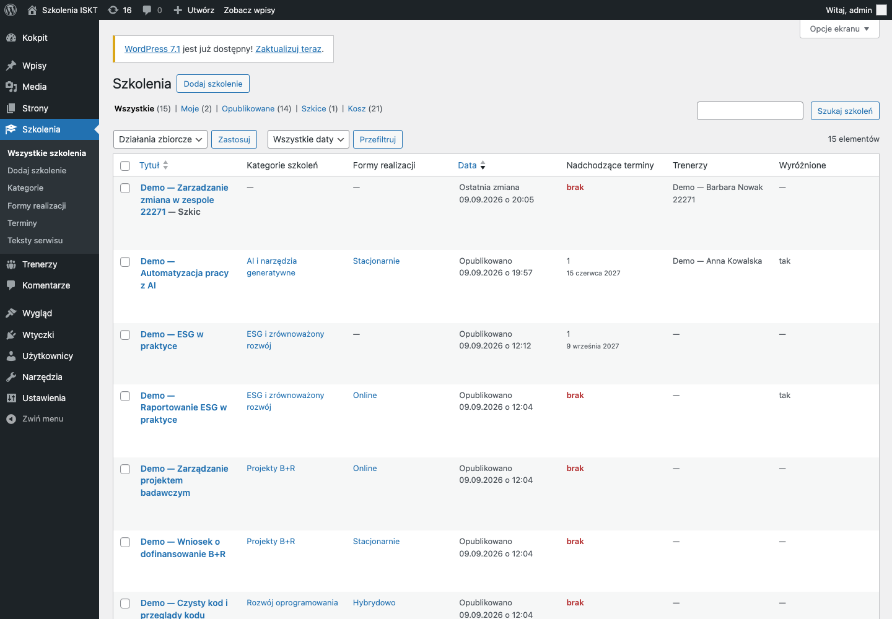

- **Nadchodzące terminy** — liczba i najbliższa data. Czerwone **„brak”** znaczy, że
  szkolenie nie ma ani jednego przyszłego terminu; na stronie pokaże się wtedy komunikat
  o braku terminów zamiast listy.
- **Trenerzy** — kto prowadzi (kreska, gdy nikt nie jest przypisany).
- **Wyróżnione** — „tak” przy szkoleniach pokazywanych na stronie głównej.
- Nad listą są odnośniki **Wszystkie / Opublikowane / Szkice / Kosz** — tam znajdziesz
  wycofane i zarchiwizowane szkolenia.

---

## 3. Terminy

### 3.1 Dodanie terminu

**Szkolenia → Terminy → Dodaj termin.** Tytułu terminu **nie wpisujesz** — serwis sam go
składa z nazwy szkolenia i daty, żeby lista terminów nigdy nie rozjechała się z faktycznymi
datami.

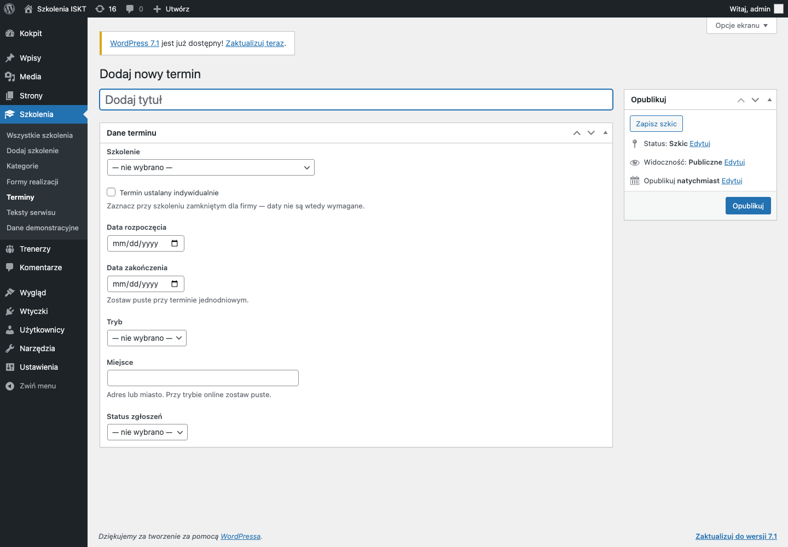

| Pole | Uwagi |
|---|---|
| **Szkolenie** | obowiązkowe. Termin bez szkolenia nie pokaże się nigdzie |
| **Termin ustalany indywidualnie** | patrz niżej |
| **Data rozpoczęcia** / **Data zakończenia** | zakończenie zostaw puste przy terminie jednodniowym |
| **Tryb** | online / stacjonarnie / hybrydowo |
| **Miejsce** | adres albo miasto; przy trybie online zostaw puste |
| **Status zgłoszeń** | zapisy otwarte / lista rezerwowa / zapisy zamknięte. Przy zamkniętych zapisach przy terminie nie pokazuje się odnośnik do zapytania |

Gdy dwa szkolenia mają identyczny tytuł, lista wyboru dopisuje przy nich rozróżnienie
(„szkic”, adres, numer), żeby nie dało się przypisać terminu do niewłaściwego.

### 3.2 Kilka terminów do jednego szkolenia

Powtarzasz „Dodaj termin” tyle razy, ile jest dat, i za każdym razem wybierasz **to samo
szkolenie**. Opisu nie powielasz — strona szkolenia pokazuje wszystkie swoje nadchodzące
terminy pod jednym opisem.

### 3.3 „Termin ustalany indywidualnie”

Zaznacz to pole przy szkoleniu zamkniętym dla firmy, dla którego nie ma konkretnej daty.
Wtedy dat nie trzeba wpisywać:

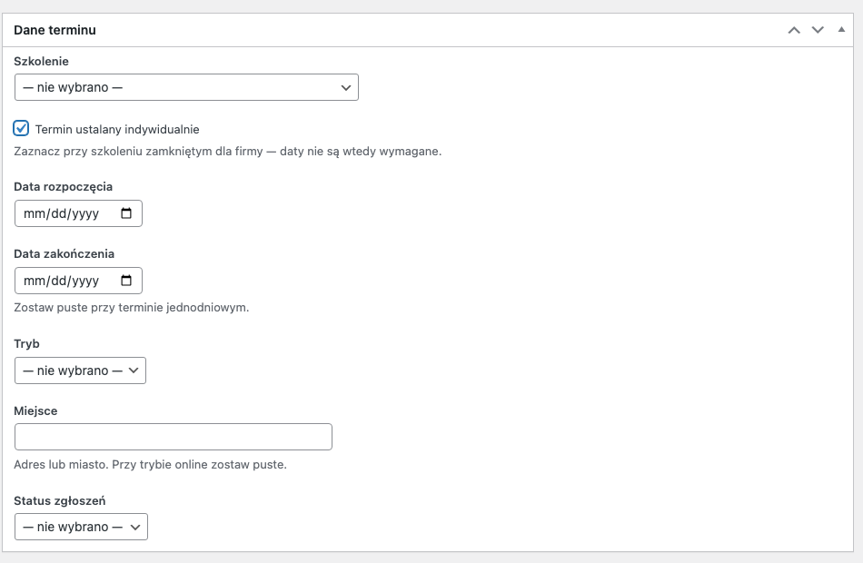

Taki termin **nigdy się nie „kończy”** — nie ma daty, po której miałby zniknąć, a jego
sensem jest to, żeby zapytanie było możliwe zawsze. Na stronie szkolenia pokazuje się jako
„Termin ustalany indywidualnie”.

### 3.4 Terminy zakończone

Termin z datą z przeszłości **sam znika** ze strony szkolenia — nie musisz go kasować.
Na liście terminów w panelu zostaje, oznaczony na czerwono jako „(zakończony)”:

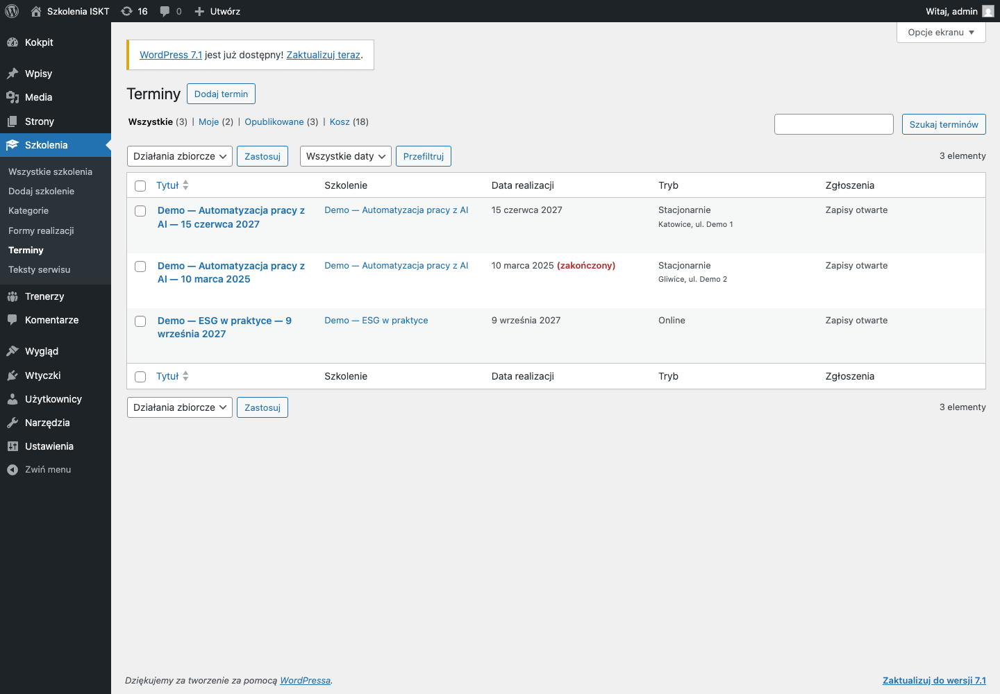

Czerwony napis **„Brak powiązania — termin się nie wyświetli”** w kolumnie „Szkolenie”
oznacza, że ktoś nie wybrał szkolenia albo szkolenie zostało trwale usunięte. Taki termin
jest niewidoczny dla odwiedzających — otwórz go i wskaż szkolenie.

---

## 4. Trenerzy

### 4.1 Dodanie trenera

**Trenerzy → Dodaj trenera.** Tytuł to imię i nazwisko, treść wpisu to biografia,
a „Dodaj zajawkę…” (prawa kolumna) to krótki opis pokazywany na liście trenerów.
Skrzynka **„Dane trenera”** jest pod edytorem:

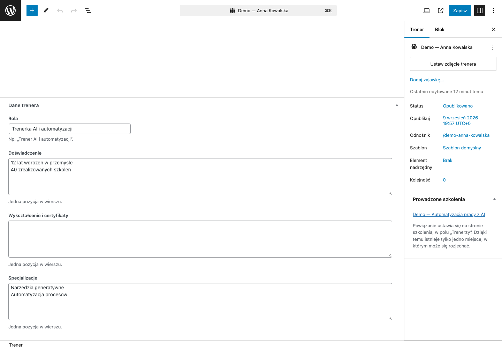

| Pole | Uwagi |
|---|---|
| **Rola** | np. „Trenerka AI i automatyzacji” |
| **Doświadczenie** | jedna pozycja w wierszu |
| **Wykształcenie i certyfikaty** | jedna pozycja w wierszu |
| **Specjalizacje** | jedna pozycja w wierszu |

Zdjęcie ustawia się przyciskiem **„Ustaw zdjęcie trenera”**. Trener bez zdjęcia nie psuje
listy — pokazuje się na niej kółko z inicjałami tej samej wielkości.

Kolejność na liście `/trenerzy/` jest alfabetyczna. Żeby kogoś wysunąć na początek, wpisz
mniejszą liczbę w polu **„Kolejność”** w prawej kolumnie (domyślnie wszyscy mają 0).

### 4.2 Powiązanie ze szkoleniem

**Powiązanie ustawia się tylko w jednym miejscu: na szkoleniu, w polu „Trenerzy”**
(rozdział 2.1). Na profilu trenera nie ma pola do wypełnienia — jest skrzynka
**„Prowadzone szkolenia”**, która sama pokazuje, co ten trener prowadzi, wraz z odnośnikami:

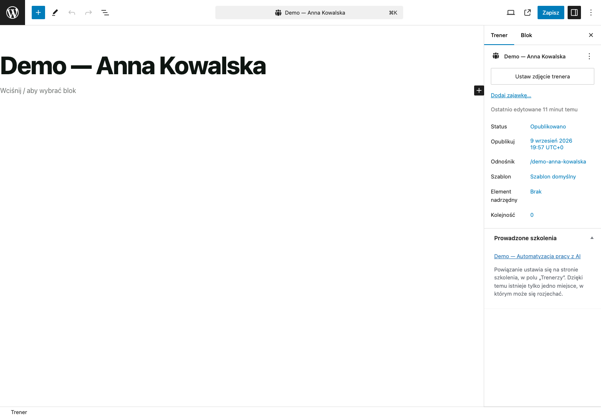

Dzięki temu powiązanie widać z obu stron, a rozjechać się nie ma czemu — jest tylko jedno
miejsce, w którym się je zapisuje.

Usunięcie trenera zdejmuje go automatycznie ze wszystkich szkoleń; same szkolenia zostają.

---

## 5. Aktualności

Aktualności to zwykłe **Wpisy** WordPressa.

- **Wpisy → Utwórz wpis** — tytuł, treść, „Ustaw obrazek wyróżniający”, kategoria
  w prawej kolumnie, „Opublikuj”.
- Lista aktualności stoi pod adresem strony ustawionej jako lista wpisów
  (u nas: `/aktualnosci/`).
- Filtr kategorii nad listą pokazuje się dopiero wtedy, gdy niepustych kategorii są
  co najmniej dwie — przy jednej kategorii filtr niczego by nie filtrował.
- Pod artykułem pokazują się szkolenia oznaczone jako **wyróżnione**. Gdy żadne nie jest
  wyróżnione, sekcja w ogóle się nie pojawia.
- Nagłówki i napisy listy oraz artykułu zmienia się w „Tekstach serwisu”, grupa
  **Aktualności**.

Szczegóły projektowe: [`PROJEKT-AKTUALNOSCI.md`](PROJEKT-AKTUALNOSCI.md).

---

## 6. Teksty serwisu — zmiana dowolnego napisu

**Szkolenia → Teksty serwisu.** To jedno miejsce na każdy napis, który nie należy do treści
konkretnego wpisu: nagłówki sekcji, etykiety formularza, przyciski, komunikaty błędów,
teksty „nic nie znaleziono”.

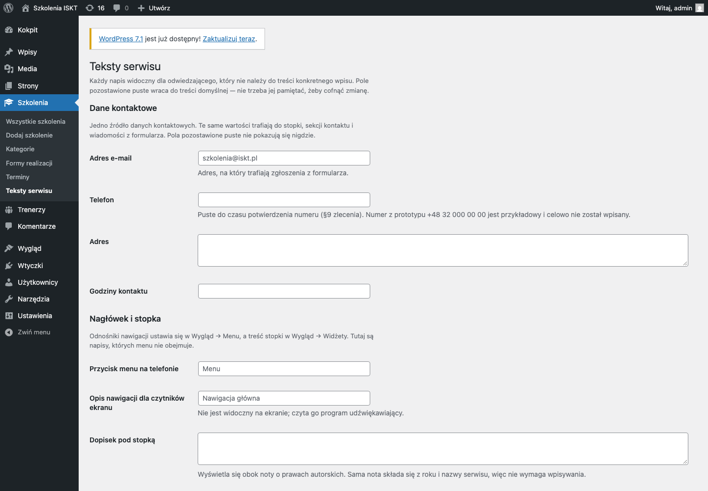

Zasada, którą warto zapamiętać jako jedyną:

> **Puste pole = treść domyślna.** Nie musisz pamiętać, co tam było — wyczyszczenie pola
> przywraca napis, z którym serwis został przekazany.

Sprawdzone klikaniem: po wpisaniu własnego napisu strona pokazała ten napis; po wyczyszczeniu
pola i ponownym zapisie wróciła treść domyślna. Gdy pole jest wypełnione, pod nim widać, jak
brzmi treść domyślna:

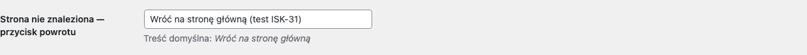

Ekran jest podzielony na grupy. Najczęściej potrzebne:

| Grupa | Co w niej jest |
|---|---|
| **Dane kontaktowe** | e-mail, telefon, adres, godziny. **Adres e-mail to jednocześnie adres, na który przychodzą zgłoszenia z formularza** |
| **Nagłówek i stopka** | przycisk menu na telefonie, dopisek pod stopką, odnośnik do informacji o prywatności |
| **Katalog szkoleń** | etykiety wyszukiwarki i filtrów, **komunikat braku wyników**, komunikat pustego katalogu |
| **Strona szkolenia** | nagłówki sekcji, podpis nad ceną, przycisk zapytania, zastrzeżenie przy przycisku |
| **Trenerzy**, **Aktualności** | nagłówki i komunikaty pustych list |
| **Formularz zgłoszeniowy** | etykiety wszystkich pól, komunikaty błędów, potwierdzenie wysłania |
| **Wyszukiwanie i strona błędu** | wyszukiwarka serwisu i strona „nie znaleziono” |

Dwie uwagi:

- **Zmiana adresu e-mail od razu przekierowuje zgłoszenia.** Jeśli pole zostanie puste albo
  wpisany zostanie adres z błędem, formularz przestanie wysyłać, a odwiedzający zobaczy
  komunikat o niedostarczeniu wiadomości — nie ciche „dziękujemy”.
- Przy dwóch polach jest prośba, żeby zachować sens tekstu przy zmianie: **zastrzeżenie przy
  przycisku** i **zastrzeżenie pod formularzem**. Wymaga tego umowa: zgłoszenie nie może być
  przedstawiane jako rezerwacja miejsca (rozdział 11).

Dwie rzeczy, których w „Tekstach serwisu” nie ma, bo mają własne miejsce w WordPressie:
**odnośniki nawigacji** (Wygląd → Menu) i **treść stopki** (Wygląd → Widżety).

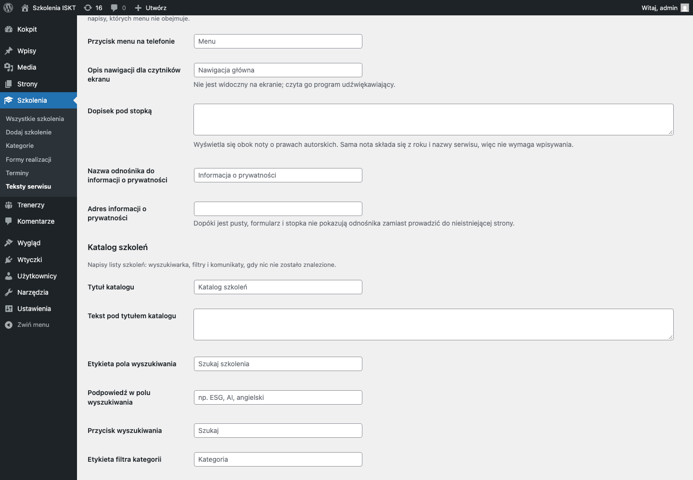

---

## 7. Strona główna: sekcje i „Dla Ciebie / Dla firm”

Strona główna to zwykła strona: **Strony → Strona główna**. Otwiera się w edytorze bloków,
w którym każda sekcja (powitanie, obszary, wyróżnione szkolenia, przebieg, dofinansowania,
kontakt) jest osobnym blokiem grupy.

Najwygodniej pracuje się z **widokiem listy** — ikona trzech linii w lewym górnym rogu:

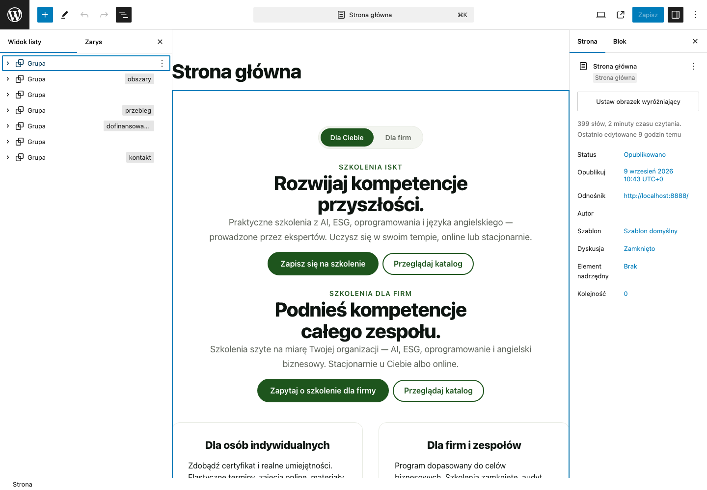

- **Przestawienie sekcji**: przeciągnij pozycję na liście w nowe miejsce.
- **Ukrycie sekcji**: usuń jej blok grupy (menu z trzema kropkami → „Usuń”). Sekcję można
  później wstawić z powrotem — przy dodawaniu bloku jest kategoria **„Sekcje ISKT”**
  z gotowymi wzorcami w układzie z projektu.
- Sekcja, w której nic nie zostało, **sama się nie wyświetla** — na stronie nie zostaje po
  niej pusty kolorowy pas. W edytorze widać ją nadal, żeby dało się ją wypełnić albo usunąć.

### Dwie wersje komunikacji

Przełącznik **„Dla Ciebie” / „Dla firm”** to blok, który wstawia się raz na stronie.
Treść, która ma się różnić między wariantami, wkłada się w blok **„Treść dla odbiorcy”** —
jeden dla wariantu indywidualnego, drugi dla firmowego. Wewnątrz działa cały edytor, więc oba
warianty pisze się tak samo jak każdą inną treść. Wariant, którego dotyczy blok, wybiera się
w ustawieniach bloku po prawej.

Na stronie głównej takich par jest kilka (powitanie, przyciski, opis procesu, kontakt) —
w widoku listy znajdziesz je, rozwijając grupy strzałką.

Wybór odwiedzającego jest częścią adresu (`?odbiorca=firmowy`), więc odnośnik do wersji
firmowej można wysłać mailem albo zapisać w zakładkach, a przycisk „Wstecz” w przeglądarce
działa normalnie.

Szczegóły układu strony głównej: [`STRONA-GLOWNA.md`](STRONA-GLOWNA.md).

---

## 8. Kategorie szkoleń i ich symbole

**Szkolenia → Kategorie.** Po lewej dodajesz nową kategorię, po prawej jest lista istniejących.

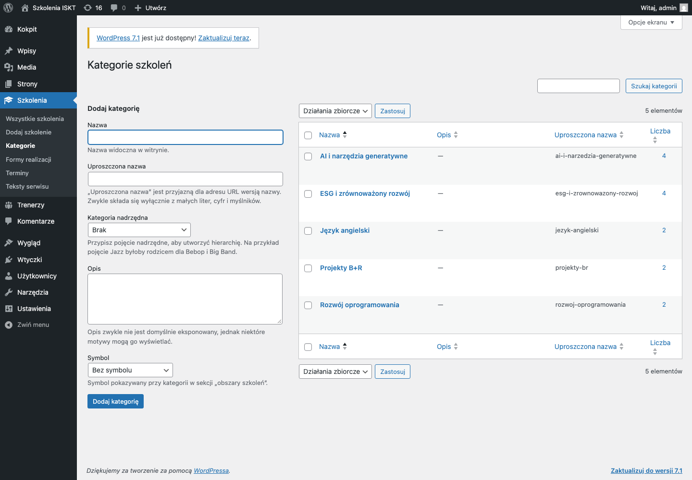

| Pole | Uwagi |
|---|---|
| **Nazwa** | to, co widzi odwiedzający |
| **Uproszczona nazwa** | wersja do adresu; zostaw puste, wypełni się sama |
| **Kategoria nadrzędna** | tylko jeśli chcesz zbudować hierarchię |
| **Opis** | nieobowiązkowy |
| **Symbol** | znak pokazywany przy kategorii w sekcji „obszary szkoleń” na stronie głównej |

**Symbol wybiera się z listy, nie wgrywa.** Dostępne są: sztuczna inteligencja, zrównoważony
rozwój, język obcy, oprogramowanie, badania i rozwój, edukacja, firma i zespół, finansowanie
oraz „Bez symbolu”. Lista jest zamknięta, bo każdy kształt musi być narysowany po stronie
serwisu — dołożenie nowego symbolu to drobna praca dla wykonawcy, nie czynność z panelu.

Ten sam ekran, tylko dla form realizacji, jest pod **Szkolenia → Formy realizacji**
(formy nie mają symboli).

Adresy kategorii wyglądają tak: `/szkolenia/kategoria/esg-i-zrownowazony-rozwoj/`.
Kafelki „obszarów” na stronie głównej prowadzą właśnie tam.

---

## 9. Zdjęcia

Wszystkie zdjęcia trafiają do **Media → Biblioteka**. Dodaje się je albo tam, albo od razu
z ekranu wpisu — przyciskiem „Ustaw grafikę szkolenia”, „Ustaw zdjęcie trenera”,
„Ustaw obrazek wyróżniający” (aktualności).

Co warto wiedzieć o proporcjach:

- **Szkolenia i aktualności — serwis nie przycina zdjęcia.** Kafel pokazuje je w takich
  proporcjach, w jakich zostało wgrane. Widać to na sprawdzeniu: kafel ze zdjęciem 1200×800
  jest wyraźnie wyższy od kafli bez zdjęcia. Jeśli zdjęcia będą miały różne proporcje, kafle
  będą różnej wysokości — dlatego **trzymaj jedną proporcję dla całej oferty**, na przykład
  3:2 (1200×800) albo 16:9 (1200×675).

  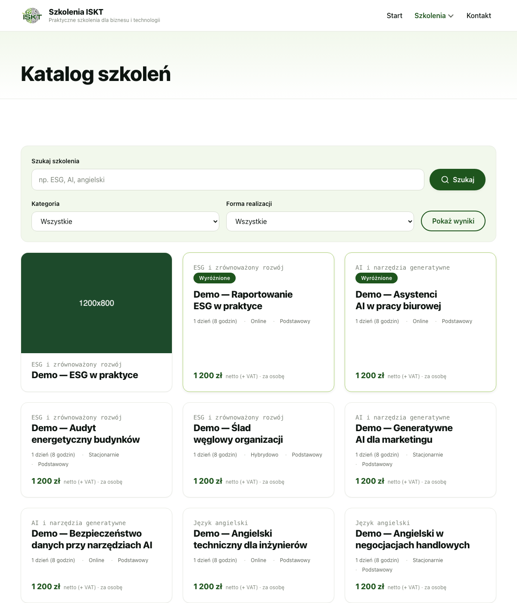

- **Trenerzy — zdjęcie jest przycinane do koła.** Wgrywaj kwadrat (np. 600×600) z twarzą
  pośrodku; przy zdjęciu poziomym obcięte zostaną boki.
- Nie trzeba wgrywać plików wielkich: serwis i tak pokazuje na listach pomniejszone kopie
  (na kaflach — wersję o szerokości 768 pikseli). Zdjęcie o szerokości 1200–1600 pikseli
  w zupełności wystarcza i nie spowalnia strony.
- **Wpisuj tekst alternatywny** w polu „Tekst alternatywny” przy zdjęciu — czyta go program
  udźwiękawiający osobie niewidomej. Dla zdjęcia czysto ozdobnego zostaw puste.

---

## 10. Kto co może — role

Serwis używa dwóch ról:

| | **Administrator** | **Redaktor** |
|---|---|---|
| Szkolenia, terminy, trenerzy, aktualności | tak | tak |
| Kategorie i formy realizacji | tak | tak |
| Teksty serwisu | tak | **tak** |
| Dane demonstracyjne | tak | tak |
| Media | tak | tak |
| Strony (w tym strona główna) | tak | tak |
| **Wygląd (menu, widżety w stopce)** | tak | **nie** |
| **Ustawienia, wtyczki, użytkownicy, aktualizacje** | tak | **nie** |

Sprawdzone przez zalogowanie się na konto redaktora: w jego menu nie ma „Wyglądu”,
„Wtyczek”, „Użytkowników” ani „Ustawień”, a wejście wprost na adres ustawień kończy się
komunikatem „Brak uprawnień dostępu do wybranej strony”. Ekran „Teksty serwisu” redaktor
otwiera normalnie.

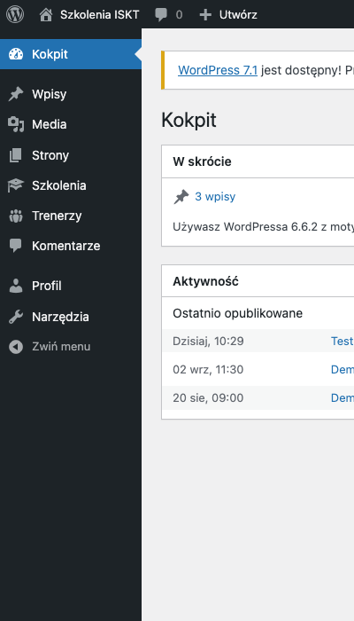

Praktycznie: **redakcji dajesz rolę „Redaktor”** — może prowadzić całą ofertę i wszystkie
napisy serwisu, a nie może przestawić menu, wyłączyć wtyczki ani zmienić ustawień serwisu.
Konta zakłada się w **Użytkownicy → Dodaj nowego** (widoczne tylko dla administratora).

Ról „Autor” i „Współpracownik” świadomie nie wyposażyliśmy w dostęp do katalogu — konto
w takiej roli nie zobaczy szkoleń ani trenerów.

---

## 11. Czego serwis nie robi

Ten rozdział istnieje po to, żeby po wdrożeniu nie było niespodzianek.

- **Zgłoszenie z formularza nie rezerwuje miejsca.** To wiadomość e-mail z zapytaniem, nie
  zapis na listę uczestników. Miejsce potwierdzasz Ty, odpisując. Napisane jest to wprost
  przy przycisku i pod formularzem — dlatego przy zmianie tych napisów prosimy zachować
  tę informację.
- **Serwis nie liczy ceny po dofinansowaniu.** Możesz zaznaczyć, że szkolenie jest objęte
  dofinansowaniem, i opisać warunki — ale kwoty „po dofinansowaniu” serwis nie wyliczy,
  bo zależy ona od operatora, wielkości firmy i naboru.
- **Nie ma płatności online ani koszyka.**
- **Zgłoszenia nie zapisują się w bazie serwisu.** Trafiają wyłącznie na skrzynkę e-mail
  z „Danych kontaktowych”. To świadoma decyzja: nie ma w serwisie zbioru danych osobowych,
  który mógłby wyciec. Skutek uboczny: **historia zgłoszeń jest w Twojej poczcie i nigdzie
  indziej** — nie da się jej odtworzyć z panelu. Rozważane warianty opisuje
  [`FORMULARZ-ZGLOSZENIOWY.md`](FORMULARZ-ZGLOSZENIOWY.md).
- **Nie ma automatycznych powiadomień do uczestników** (przypomnienia o terminie,
  potwierdzenia udziału).
- **Zakończony termin sam znika ze strony**, ale nie usuwa się z panelu — sprzątanie starych
  terminów jest ręczne, jeśli w ogóle chcesz je usuwać.
- **Serwis nie sprawdza liczby miejsc.** Pole „Status zgłoszeń” przy terminie ustawiasz sam;
  nic nie policzy za Ciebie, ile osób już napisało.

---

## 12. Kopia, przeniesienie, dane demonstracyjne

- **Kopia zapasowa, eksport, import i przywrócenie serwisu** — opisuje je osobny dokument
  przekazania (zadanie 13 planu). Ta instrukcja świadomie ich nie powtarza, żeby nie powstały
  dwa różne opisy tej samej czynności.
- **Usunięcie treści demonstracyjnych** (wpisy „Demo — …” założone na pokaz) robi się na
  ekranie **Szkolenia → Dane demonstracyjne**: pokazuje spis tego, co zostanie usunięte,
  i kasuje wyłącznie oznaczone pozycje. Szczegóły i uzasadnienie:
  [`DANE-DEMONSTRACYJNE.md`](DANE-DEMONSTRACYJNE.md).
- **Przed uruchomieniem na docelowej domenie** trzeba jeszcze włączyć widoczność dla
  wyszukiwarek: **Ustawienia → Czytanie**, odznaczyć „Proś wyszukiwarki o nieindeksowanie
  tej witryny”. Środowisko robocze celowo stoi poza indeksem.

---

## 13. Kiedy coś nie wygląda tak, jak powinno

| Objaw | Najczęstsza przyczyna | Co zrobić |
|---|---|---|
| Szkolenia nie ma w katalogu | jest szkicem albo w koszu | Szkolenia → sprawdź status, kliknij „Opublikuj” |
| Termin nie pokazuje się na stronie szkolenia | data już minęła **albo** termin nie ma wybranego szkolenia | otwórz Terminy — zakończone mają czerwony dopisek, niepowiązane czerwone ostrzeżenie |
| Szkolenie przywrócone z kosza dalej nie otwiera się na stronie | wróciło jako **szkic**, a nie jako opublikowane | otwórz je i kliknij „Opublikuj” |
| Cena nie pokazuje się na stronie | pole „Cena” jest puste albo wpisano w nim „zł” | wpisz samą liczbę |
| Trener nie ma szkoleń na profilu | powiązanie ustawia się na szkoleniu | otwórz szkolenie → pole „Trenerzy” |
| Zmieniony napis nie pojawił się na stronie | zmiana w innym polu, niż się wydaje | w „Tekstach serwisu” pola są pogrupowane ekranami; skorzystaj z wyszukiwania w przeglądarce (Ctrl+F / Cmd+F) |
| Chcę cofnąć zmianę napisu | — | wyczyść pole i zapisz — wróci treść domyślna |
| Formularz pokazuje błąd wysyłki | pusty albo błędny adres w „Dane kontaktowe → Adres e-mail” | popraw adres |
| Sekcja strony głównej zniknęła | została opróżniona z treści — puste sekcje nie wyświetlają się | wypełnij ją albo wstaw sekcję z kategorii „Sekcje ISKT” |
| Kafle w katalogu mają różną wysokość | zdjęcia o różnych proporcjach | ujednolić proporcje zdjęć (rozdział 9) |

---

## 14. Co zostało sprawdzone przy pisaniu tej instrukcji

Zrzuty ekranu: `qa-artifacts/isk-31-administracja/`. Wykonane w panelu pod
`http://localhost:8888/wp-admin` (WordPress 6.6.2, motyw `iskt-szkolenia`,
wtyczka `iskt-szkolenia-core`).

| Twierdzenie instrukcji | Jak sprawdzone |
|---|---|
| Wycofanie do szkicu: strona „nie znaleziono”, znika z katalogu, terminy zostają | wykonane na szkoleniu próbnym; strona zwróciła 404, katalog 0 trafień, termin dalej opublikowany z zachowanym powiązaniem |
| Ponowna publikacja przywraca **ten sam** adres | wykonane; adres identyczny jak przed wycofaniem |
| Kosz zachowuje się jak szkic, a przywrócenie daje **szkic** | wykonane; po przywróceniu status „draft” |
| Trwałe usunięcie szkolenia kasuje jego terminy | wykonane; po usunięciu szkolenia termin przestał istnieć |
| Zmiana tytułu nie zmienia adresu | wykonane; adres po zmianie tytułu bez zmian |
| Zmiana odnośnika zostawia przekierowanie ze starego adresu | wykonane; stary adres odpowiedział 301 na nowy |
| Tytuł terminu składa się sam z nazwy szkolenia i daty | wykonane; termin dostał tytuł „… — 10 maja 2027” |
| Puste pole w „Tekstach serwisu” wraca do treści domyślnej | wykonane klikaniem w panelu: wpisany napis pojawił się na stronie, po wyczyszczeniu pola wróciła treść domyślna |
| Redaktor ma katalog i teksty serwisu, nie ma wyglądu, wtyczek, użytkowników i ustawień | wykonane przez zalogowanie się na konto redaktora; ustawienia i wtyczki zwróciły „Brak uprawnień” |
| Kafel katalogu nie przycina zdjęcia szkolenia | wykonane; zdjęcie 1200×800 pokazane w proporcji 3:2 (kopia 768 px), kafel wyższy od pozostałych |
| Powiązanie trenera widać z obu stron | wykonane; profil trenera pokazał prowadzone szkolenie, szkolenie — trenera |

Konta i wpisy założone na potrzeby tych sprawdzeń zostały usunięte.
